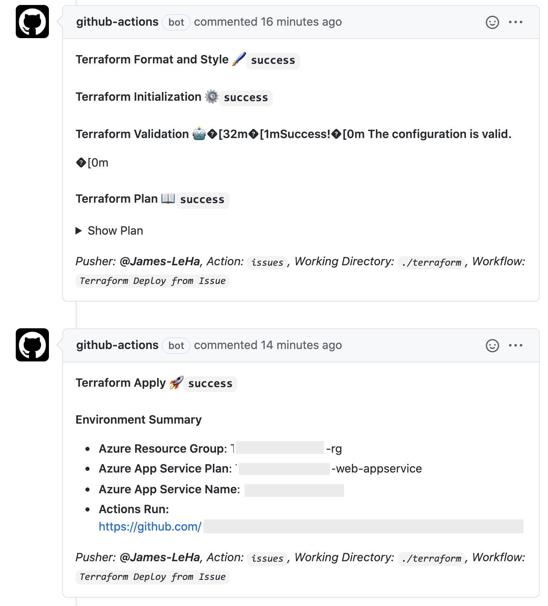
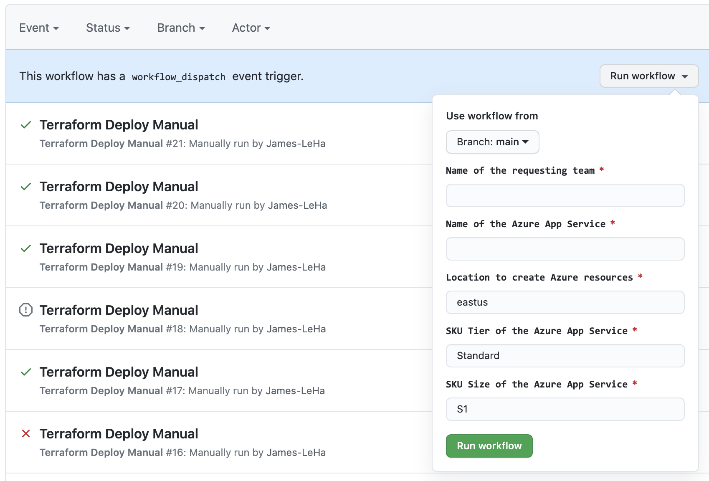

# GitHub ➕ Azure ➕ Terraform
## About
Using GitHub Actions for Azure deployments with Terraform! 

Deploys an Azure resource group and app service, utilizing the [Terraform Azure Provider](https://www.terraform.io/docs/providers/azurerm/).


## Getting Started
### Generate Azure Service Principal
To deploy to Azure you will need to create a service principal. You can do that with the following command:

```sh
az ad sp create-for-rbac --name {yourServicePrincipalName} --role contributor \
                            --scopes /subscriptions/{subscription-id} \
                            --sdk-auth

  # Replace {yourServicePrincipalName}, {subscription-id} with the a service principal name and subscription id.

  # The command should output a JSON object similar to the example below

  {
    "clientId": "<GUID>",
    "clientSecret": "<GUID>",
    "subscriptionId": "<GUID>",
    "tenantId": "<GUID>",
    (...)
  }
```

 *This service principal does the work but is probably way too powerful for what you need, you might want to consider reducing its privileges, check the [docs](https://docs.microsoft.com/en-us/cli/azure/create-an-azure-service-principal-azure-cli?view=azure-cli-latest) to know more!*
  
### Creating GitHub Secrets
Add the JSON output as the following secrets in the GitHub repository:

> `TF_VAR_agent_client_id` 

> `TF_VAR_agent_client_secret` 

> `TF_VAR_subscription_id` 

> `TF_VAR_tenant_id` 

For steps to create and storing secrets, please check [here](https://docs.github.com/en/actions/configuring-and-managing-workflows/creating-and-storing-encrypted-secrets)

These secrets are assigned in the workflow .yml files for the AzureRM Provider Argument References found [here](https://registry.terraform.io/providers/hashicorp/azurerm/latest/docs#argument-reference)

> `ARM_CLIENT_ID: ${{ secrets.TF_VAR_agent_client_id }}`

> `ARM_CLIENT_SECRET: ${{ secrets.TF_VAR_agent_client_secret }}`

> `ARM_SUBSCRIPTION_ID: ${{ secrets.TF_VAR_subscription_id }}`

> `ARM_TENANT_ID: ${{ secrets.TF_VAR_tenant_id }}`

### Triggering the workflow
The workflow file is located in `./github/workflows/main.yaml` 

You can setup workflow triggers on dozens of different GitHub event, manual, and webhook events! See: [Events that trigger workflows](https://docs.github.com/en/free-pro-team@latest/actions/reference/events-that-trigger-workflows)

#### Issue Ops 
To trigger the workflow via a GitHub Issue template and labels (`workflows/deploy_from_issue.yml`):
1. Navigate to the **Issues** Tab
2. Create a New Issue using template **Terraform Request - Azure App Service**
3. Fill out the Title and Body, the below JSON body is used to create Azure Resources:
```json
{
    "requesting_team": "Team-Name",
    "app_service_name": "Application-Name",
    "location": "eastus",
    "sku_tier": "Standard",
    "sku_size": "S1"
} 
```
4. When an authorized user applies the label `approved` the workflow will pass the permission check and create the Azure resources.
5. The workflow will create comments on the issue during Terraform steps.

6. Verify in the **Azure Portal** the resource group, app service plan app service, and policies were created/applied.
7. Close the issue to trigger `workflows/teardown_from_issue.yml`, which will **delete** the Azure Resource Group

#### Workflow Dispatch - Manual trigger
To trigger the manual workflow (`workflows/deploy_from_workflow_dispatch.yml`):
1. Navigate to the **Actions** tab
2. On the left hand pane under *Workflows*, select the workflow name (Terraform Deploy)
3. Click the *Run workflow* drop-down menu, select the branch to run, fill out the appropriate values and click *Run workflow*

4. A new issue will be created with the Terraform details.

## Future Enhancements
- Integrate Terraform Cloud to manage State
- Further Issue Ops configurations for policies based on type of project (HIPPA, PCI, etc.)
- Alert Issue requestor of deployed environments/publish profiles/etc.
